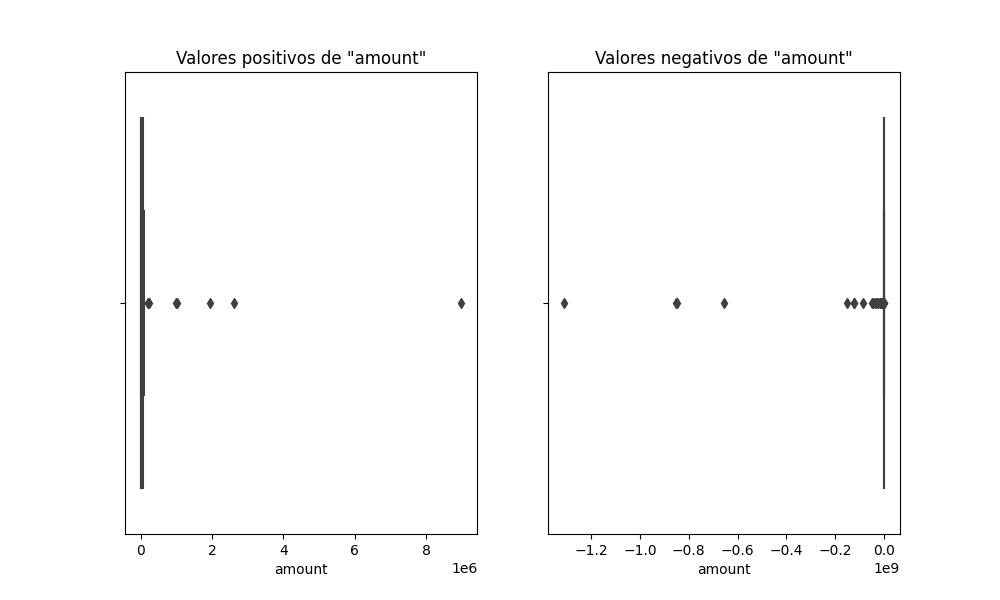
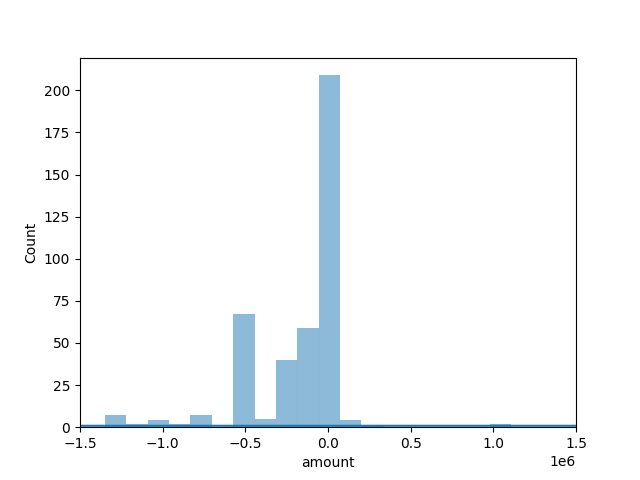

# CARS_INSURANCE
Generación de SCRIP para obtener insights del negoció y un reporte PDF automático.

## Tabla de Contenidos
- [Descripción General](#descripción-general)
- [Productos entregados](#productos-entregados)
- [Análisis Exploratorio de Datos (EDA)](#análisis-exploratorio-de-datos-(EDA))
- [Documentación del flujo del Scrip.py](#documentación-del-flujo-del-scrip.py)
- [Ejecución](#Ejecución)

## Descripción General

El proyecto "Crabi Data Analysis" se centra en analizar y comprender diversos aspectos relacionados con las pólizas de seguros de Crabi, con un enfoque especial en la ocurrencia de siniestros. La información se extrae de la carpeta [Archivos](./Archivos/) proporcionada por Crabi. El análisis aborda conceptos clave como siniestralidad, reservas, servicios, severidad, y otros aspectos relevantes del ciclo de vida de una póliza de seguro.

## Productos entregados

-Se realizó un código en el archivo [Scrip](./Scrip.py) que al ejecutarse responde en consola las diferentes preguntas propuestas  y  genera un archivo PDF con un [Informe de Resultados](./informe.pdf) (el código que permite generar el informe se encuentra en el archivo ['Informe.py'](./Informe.py)), este Scrip garantiza la capacidad de recalcular resultados con cambios en los datos fuente. 

Nota: Se abordo el escenario, donde se tiene los archivos almacenadas en un carpeta local pero, se tiene la posibilidad de conectar directamente a Google Drive desde la API de Google Cloud.
 

-Dashboard en tableau.

## Análisis Exploratorio de Datos (EDA)

El [EDA](./Notebooks/EDA.ipynb) se lleva a cabo para comprender mejor la naturaleza y la estructura de los conjuntos de datos proporcionados por Crabi. Se analizo cada una de las tablas (service,claim,people,status,status_type,status_cause) utilizadas para obtener los insights.

En el [archivo](./Notebooks/EDA.ipynb) alojado en la carpeta Notebooks podemos encontrar más detalles, sobre las tablas. 

Ejemplo de la importancia del EDA

Service:

### Se debe revisar la veracidad de los datos en la columna amount.
-La columna "amount" tiene una gran variabilidad en sus valores, con una media negativa y valores extremadamente bajos (negativos) y altos. La mediana es negativa, indicando una asimetría hacia la izquierda en la distribución de los datos. La desviación estándar es bastante alta, lo que refleja la dispersión amplia de los valores.

Distribución de amount, quitando los valores atípicos: Se reafirma la distribución cargada a los valores negativos y un gran cantidad de valores con amount igual a cero, también se debe comprobar porque tienen 0 esos servicios y de ahí decidir si sirve incluirlos para futuros análisis. 

Debido al contexto de la prueba al no poder tener cada detalle del negocio, se trabaja con todos los datos  proporcionados pero se proponen realizar los siguientes pasos: 

Limpieza de Datos:

Abordar valores nulos o inconsistencias identificadas durante el EDA.
Garantizar la integridad de los datos antes de realizar análisis más avanzados

Análisis Detallado:

Profundizar en áreas específicas de interés identificadas durante el EDA.
Refinar y ajustar preguntas analíticas para una comprensión más precisa.

## Documentación del flujo del Scrip.py

En la carpeta Notebooks se encuentra disponible el [Flujo Documentado del Proceso](./Notebooks/Flujo_Documentado.ipynb), un archivo Jupyter Notebook (.ipynb) que proporciona una visión detallada del código y el proceso utilizado para abordar las consultas planteadas en el proyecto "Crabi Data Analysis".

Objetivo del Notebook
El notebook sirve como una guía completa y detallada del proceso seguido para llegar a los resultados presentados en el script Python (script.py). Facilita la comprensión del análisis realizado, las decisiones tomadas y proporciona transparencia en cada etapa del flujo de trabajo.

Nota: Se recomienda revisar el Flujo Documentado del Proceso para obtener una comprensión más profunda de la solución propuesta y el enfoque adoptado durante el análisis de los datos de Crabi.

## Ejecución

-Clonar el repositorio desde GitHub.

-Installar (pip install requierements.txt) mediante la consulta el archivo [requierements.txt](./requirements.txt)

-Ejecutar el script en Python para realizar el análisis.

-Explorar los resultados en la consola de salida y o en el informe generado en la carpeta.

